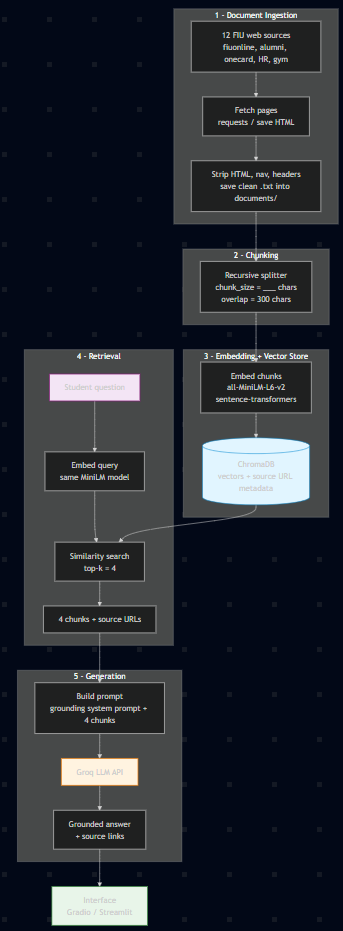

# Project 1 Planning: The Unofficial Guide

> Write this document before you write any pipeline code.
> Your spec and architecture diagram are what you'll use to direct AI tools (Claude, Copilot, etc.) to generate your implementation — the more specific they are, the more useful the generated code will be.
> Update the Retrieval Approach and Chunking Strategy sections if you change your approach during implementation.
> Update this file before starting any stretch features.

---

## Domain

<!-- What domain did you choose? Why is this knowledge valuable and hard to find through official channels? -->

The domain I chose is student discounts and perks. This knowledge is important to students so they can take advantage of everything FIU has to offer them. Students can get discounts on a variety of things, save money where they can, and enrich their lives more while in school. It is not always easy to find these discounts: some pages are from years ago and were never taken down, and some aren't advertised enough — if at all. It's like a secret they don't want you to know about, and this needs to change.
---

## Documents

<!-- List your specific sources: URLs, subreddit names, forum threads, or file descriptions.
     Aim for at least 10 sources that together cover different subtopics or perspectives within your domain. -->

| # | Source | Description | URL or location |
|---|--------|-------------|-----------------|
| 1 | FIU online web page | This page has a list of some perks students can take advantage of | https://fiuonline.fiu.edu/about-us/story-hub/student/5-life-hacks-to-save-money-as-a-college-student.php |
| 2 | FIU online page | 10 ways to slay your next semester online | https://fiuonline.fiu.edu/about-us/story-hub/student/10-ways-to-slay-your-next-semester-online.php |
| 3 | FIU's webpage | FIU Food Pantry | https://dasa.fiu.edu/all-departments/student-food-pantry/ |
| 4 | Unidays web page | Student ID for discounts | https://www.myunidays.com/US/en-US |
| 5 | FIU News article | FIU's iGrad financial wellness partnership for students/faculty/staff | https://news.fiu.edu/2020/fiu-offers-interactive,-digital-financial-literacy-platform-and-financial-wellness-coaches-to-university-community |
| 6 | FIU alumni page | FIU discounts for alumni (Disneyland, etc.) | https://fiualumni.com/resources/discounts/ |
| 7 | FIU transfer website (Connect4Success) | FIU One Card Benefits | https://transfer.fiu.edu/connect4success/one-card-benefits/ |
| 8 | Gallo 8 Gym webpage | Gyms with student discounts in Miami | https://gallo8gym.com/blog/gyms-with-student-discounts-miami |
| 9 | FIU Human Resources page | Employee perks and services | https://hr.fiu.edu/employees-affiliates/benefits/perks-services/ |
| 10 | FIU Sports page | Ticket Smarter and FIU Miami entertainment guide | https://fiusports.com/news/2024/2/21/general-ticket-smarter-and-fiu-miami-entertainment-guide.aspx |
| 11 | FIU One Card page | FIU One Card employee perks | https://onecard.fiu.edu/card-perks/employee-perks/ |
| 12 | FIU Libraries LibAnswers FAQ | What free software students can access from home and how to download it | https://libanswers.fiu.edu/faq/18206 |
| 13 | PantherNOW article | FIU perks for commuters (free air/inflation station, jump-start help) | https://panthernow.com/2023/04/10/commuters-here-are-some-fiu-perks-you-should-know-about/ |
---

## Chunking Strategy

<!-- How will you split documents into chunks?
     State your chunk size (in tokens or characters), overlap size, and explain why those
     numbers fit the structure of your documents.
     A review-heavy corpus warrants different chunking than a long FAQ. -->

**Chunk size:**

800

**Overlap:**

120 characters

**Reasoning:**

My sources are web pages of FIU discounts and perks — mostly short, list-style, factual items (e.g. a gym discount, the food pantry hours, a One Card benefit). Each perk is a small, self-contained fact, so I want chunks small enough that one chunk stays on a single topic — if several unrelated perks get averaged into one embedding, retrieval gets fuzzy. 800 characters (~150 words) is big enough to keep one perk together with its conditions (who qualifies, how to redeem) but small enough to stay "sharp." I use a recursive splitter so it breaks on natural boundaries (paragraphs, then sentences) rather than mid-word, which suits pages that vary a lot in length and format. Overlap is set to 120 characters (~15%) to catch facts that straddle a chunk boundary without duplicating large amounts of text — a 300-character overlap on an 800-character chunk would duplicate over a third of every chunk and crowd my top-k=4 retrieval with near-identical neighbors.
---

## Retrieval Approach

<!-- Which embedding model are you using (e.g., all-MiniLM-L6-v2 via sentence-transformers)?
     How many chunks will you retrieve per query (top-k)?
     If you were deploying this for real users and cost wasn't a constraint, what tradeoffs
     would you weigh in choosing a different embedding model — context length, multilingual
     support, accuracy on domain-specific text, latency? -->

**Embedding model:**

all-MiniLM-L6-v2 via the sentence-transformers library

**Top-k:**
4
**Production tradeoff reflection:**
For this project I used all-MiniLM-L6-v2 because it is small, fast, runs locally for free, and is accurate enough for short factual perk text. If I were deploying this for real FIU students and cost wasn't a constraint, I would switch to a hosted API embedding model and weigh these tradeoffs:

- **Multilingual support:** FIU's student body is heavily Spanish-speaking, so I'd choose a model trained on Spanish + English so a question asked in Spanish still retrieves the right English perk — MiniLM is English-only and would miss those.
- **Domain accuracy:** I'd pick a model that handles short, entity-heavy text well (program names like "Panther Perks," "iGrad," "One Card"), since accuracy on these specific names matters more than understanding long passages.
- **Context length:** my chunks are only ~800 characters, so I don't need a long-context model — paying for max input length would be wasted; medium context is plenty.
- **Latency:** since this is a live, interactive Q&A tool, I'd accept slightly higher per-call cost for a low-latency hosted endpoint so students aren't left waiting on responses.
---

## Evaluation Plan

<!-- List your 5 test questions with their expected correct answers.
     Questions should be specific enough that you can judge whether the system's response
     is right or wrong. "What are good dining halls?" is too vague.
     "What do students say about wait times at [dining hall name] during lunch?" is testable. -->

| # | Question | Expected answer | Source # |
|---|----------|-----------------|----------|
| 1 | does FIU have any resources to help students with personal finance? | FIU has partnered with iGrad to offer financial wellness tools to students (as well as faculty and staff) across the university| 5 |
| 2 | where can I find the free software provided to students? | FIU students can download free software (e.g. Microsoft Office at freeoffice.fiu.edu and programs via eLabs @FIU) by logging in with their FIU credentials; see the FIU Libraries software FAQ. | 12 |
| 3 | what Discounts are there for alumni?| FIU HAS A Panther Perks Program that has a variety of different discounts listed | 6 |
| 4 | what are the FIU One Card Benefits| Attend Home Athletic Games, FIU Library Privileges like: Book-borrowing privileges: 10 books for 30 days, with 1 online renewal. Access to all online databases while inside the library. Access to librarians with expertise in specific disciplines. Remote access to online databases and Wellness & Recreation Center From yoga to swimming, kayaking to personal training, FIU’s Wellness & Recreation Center (WRC) is more than just a gym!| 7 |
| 5 | How does FIU help Car Owners?|  free inflation station around campus that is easy to use. If a car needs to be jump started, help is closer than ever, free, and only a phone call away. | 13 |

---

## Anticipated Challenges

<!-- What could go wrong? Name at least two specific risks with reasoning.
     Consider: noisy or inconsistent documents, missing source attribution, off-topic
     retrieval, chunks that split key information across boundaries. -->

1. due to my varying sources there is a possibility of information being cut off, or off topic information

2. there could be information that is missed or is not added due to the variety of different types of webpage displays

---

## Architecture

<!-- Draw a diagram of your pipeline showing the five stages:
     Document Ingestion → Chunking → Embedding + Vector Store → Retrieval → Generation
     Label each stage with the tool or library you're using.
     You can use ASCII art, a Mermaid diagram, or embed a sketch as an image.
     You'll use this diagram as context when prompting AI tools to implement each stage. -->

---

## AI Tool Plan

<!-- For each part of the pipeline below, describe:
     - Which AI tool you plan to use (Claude, Copilot, ChatGPT, etc.)
     - What you'll give it as input (which sections of this planning.md, which requirements)
     - What you expect it to produce
     - How you'll verify the output matches your spec

     "I'll use AI to help me code" is not a plan.
     "I'll give Claude my Chunking Strategy section and ask it to implement chunk_text()
     with my specified chunk size and overlap" is a plan. -->

**Milestone 3 — Ingestion and chunking:**

- *Tool:* Claude (Claude Code).
- *Input I'll give it:* my Documents table (the 13 URLs) and my Chunking Strategy section (chunk size = 800, overlap = 120, recursive), plus requirements.txt.
- *What I expect it to produce:* (1) an ingestion script that fetches each of the 13 URLs, strips HTML/nav/footer boilerplate, and saves clean `.txt` files into `documents/` while recording each file's source URL; (2) a `chunk_text(text, size=800, overlap=120)` function using a recursive splitter (splits on paragraphs, then sentences, then characters).
- *How I'll verify:* confirm one `.txt` per source and that the text reads as real content, not menu/footer junk. Then check that no chunk exceeds 800 characters, that overlap is present between consecutive chunks, and print the total chunk count.

**Milestone 4 — Embedding and retrieval:**

- *Tool:* Claude.
- *Input I'll give it:* my Retrieval Approach section (all-MiniLM-L6-v2 via sentence-transformers, top-k = 4) and the chunk format from Milestone 3.
- *What I expect it to produce:* code that embeds every chunk with all-MiniLM-L6-v2 and stores the vectors in ChromaDB **with the source URL saved as metadata**, plus a `retrieve(query, k=4)` function that embeds the query with the same model and returns the top 4 chunks along with their source URLs.
- *How I'll verify:* run my 5 evaluation questions through `retrieve()` and confirm the returned chunks come from the Source # I mapped in the Evaluation Plan (e.g. Q1 → #5 iGrad, Q5 → #13 PantherNOW). If a question pulls the wrong source, I'll revisit chunk size or top-k.

**Milestone 5 — Generation and interface:**

- *Tool:* Claude.
- *Input I'll give it:* the Grounded Generation requirements from README.md and the retrieval output from Milestone 4.
- *What I expect it to produce:* a Groq LLM call wrapped with a grounding system prompt that instructs the model to answer **only** from the retrieved chunks, to say "I don't know based on the available sources" when the context doesn't cover the question, and to cite the source URL(s) it used; plus a simple Gradio (or Streamlit) interface for asking questions.
- *How I'll verify:* run all 5 evaluation questions end-to-end and compare answers to my expected answers, checking that each cites the correct source. Then ask an off-domain question (e.g. "what's the weather?") to confirm the system refuses instead of hallucinating.
